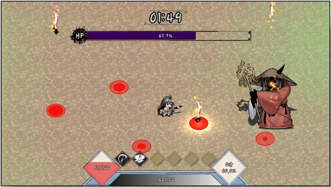

# BrushFury_SourceCode
### GameMakers 9기 프로젝트 "붓붓무쌍"
### 개발 기간 : 2024.10. ~ 2025.01.18. / 2025.01.19. ~
### 출시 일자 : 2025.08. (예정)
    끊임없이 몰려오는 적들로 부터 자신을 강화하며 살아남는 뱀서라이크 장르의 게임입니다.
    제한 시간동안 버티면 나타나는 보스 몬스터를 무찔러서 스테이지를 클리어할 수 있습니다.
----
#### 제가 작성한 코드만 업로드 하였습니다.
#### 다른 기여자가 있는 경우, 스크립트 상단에 주석으로 표시했습니다. 
#### 프로젝트가 아직 진행중이기 때문에, 테스트 코드 및 지난 버전의 코드를 정리하지 않고 모두 포함시켰습니다.
#### 지속적으로 업데이트할 예정입니다.
#### 최종 업데이트 : 2025.04.10.
---
## [ 인게임 이미지 ]

---
## [ 본인 역할 ]
- **인/아웃 게임 기능 전반 개발**
  - 게임 메인 플로우 - 로비->게임->종료  
  - 플레이어 제어 / 능력치 / 능력 사용 및 획득 시스템
  - 적 인공지능과 능력 사용 시스템 - NavMeshAgent와 Unitask 사용
  - 핵심 게임 요소들의 종류와 기능 구현 ( 적 / 적 기술 / 스킬 / 아이템 )
  - 자주 사용되는 기능을 정적클래스의 유틸함수로 구현
  - 사용자 설정 기능 - AudioMixer와 PlayerPrefs 사용
  - Dotween을 사용한 각 종 연출 및 UI
  - 협업 중심 구조 설계 - ScriptableObject와 SerializableDictionary를 사용하여 비개발 직군도 편하게 값 수정 가능
  - Billboard 기능 구현
    
- **시각 효과 개선**
    - Spine 사용하여 부드럽고 생동감있는 2D 애니메이션 적용
    - Shader Graph와 파티클 이펙트를 수정 및 직접 제작하여 다양한 효과 제작
    - MaterialPropertyBlock 사용하여 개별적인 머티리얼 제어를 효과적으로 진행
 
- **성능 개선**
    - 오브젝트 풀링 - 기존 플러그인을 개조하여 최적화 진행함
    - FastRemoveList 자료구조 구현 - 경험치 오브젝트의 개수 제한을 걸기 위해, 랜덤접근, Remove, Add가 효율적인 자료구조
    - BFS 노드 조건 탐색 기능 구현 - 경로의 절차적 생성을 빠르게 진행하기 위함.
 
- **팀장 역할 및 기획 총괄**
    - 25.01.18 이후 팀의 개편과 동시에 팀장 역할을 위임받음
    - Notion으로 개발 요소 및 직군별 업무를 정리
---
## [ 구조도 ]
첫 번째 디렉토리는 사용되는 씬을 기준으로, 두 번째,세 번째 디렉토리는 세부 기능별로 분류하였습니다.
그중에서 중요한 기능들만 표시하였습니다.

<pre><code>
📁 -1_Global
📁 0_Loading       : 현재 미사용
📁 1_Lobby
📁 2_CutScene      : 현재 미사용
📁 3_Main
│ ├── 📁 0_System
│ ├── 📁 1_UI
│ ├── 📁 2_GamePlay
│ │    ├── 📁 Stage    
│ │    ├── 📁 Player
│ │    ├── 📁 PlayerProjectile
│ │    ├── 📁 Enemy
│ │    ├── 📁 EnemyProjectile
│ │    ├── 📁 DropItem
│ │    ├── 📁 Effect
│ │    ├── 📁 AreaIndicator
│ │    ├── 📁 InteractiveObjects    : 현재 미사용
📁 4_Sanctuary    : 현재 미사용
📁 5_Ending       : 현재 미사용
📁 99_Test
  </code></pre>
